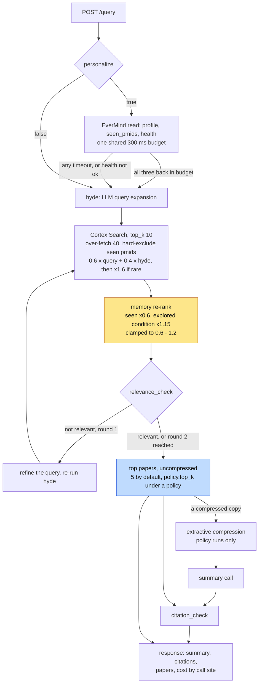
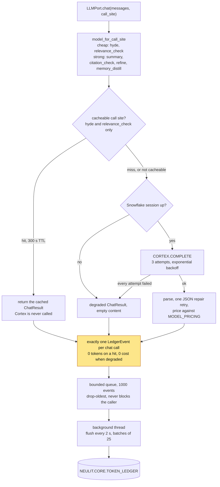

# NeuLitTrace

NeuLitTrace is a memory-aware literature research assistant for neurologists and neuroscience researchers. It searches a focused corpus, checks relevance, writes a cited summary, remembers what a researcher has already explored, and attaches token cost to the answer.

## The problem

Clinical literature work is repetitive and expensive: the same papers resurface, personalization is usually invisible, and multi-step agents rarely show which step consumed the budget. NeuLitTrace makes retrieval, memory effects, and cost attribution inspectable.

## Who it is for

- Clinicians investigating uncommon neurological presentations
- Researchers building a trail across related conditions
- Teams evaluating the cost and reliability of agent pipelines

## What it is not

NeuLitTrace is not a diagnostic device, a substitute for clinical judgment, or a comprehensive medical index. It is a focused research demo whose claims remain linked to source papers.

## How it works

1. A query loads the researcher's EverMind profile when personalization is enabled.
2. Snowflake Cortex Search retrieves papers from the corpus.
3. Memory applies a bounded re-rank so prior work can help without outranking rarity.
4. Cortex COMPLETE runs the applicable calls across six named inference call sites and produces a sourced summary.
5. Each inference call writes a priced row to `TOKEN_LEDGER`.
6. The economy view aggregates spend by step and hour. The staged `/economics/ask` endpoint degrades cleanly; real Cortex Analyst answers still require the dedicated REST integration.
7. The thread and distilled profile are updated for the next query.

The backend exposes retrieval, inference, memory, and ledger through separate ports. A memory or ledger outage therefore degrades one capability instead of collapsing the whole request.

## Snowflake integration

Snowflake provides corpus retrieval through Cortex Search, inference through Cortex COMPLETE, per-call economics in `TOKEN_LEDGER`, and aggregate economics views. Trace exposes an Analyst-shaped API surface, but the live gate showed that its current COMPLETE-based call is invalid; dedicated Cortex Analyst REST integration remains unimplemented. The UI shows values returned by the ledger rather than substituting benchmark claims.

The credential-free measurement gate used 28 queries and 280 abstracts: extractive selection reduced estimated context tokens from 64,947 to 42,401 (34.71%), while a representative summary-shaped cost calculation moved from $0.009000 to $0.00775044 (13.88% compression-only). A deliberately synthetic repeat exercise produced 28 cache hits and 28 misses. These verify the local compression, cache, and pricing code paths; they are not live Snowflake consumption or an organic cache-rate claim.

The live account gate verified 329 papers, 14 conditions, 10 rare conditions, an active Cortex Search service over all 329 rows, a successful `claude-sonnet-4-5` COMPLETE call, and ledger read-back for both successful and degraded calls. Three of four Tier-2 live tests passed; the failing test confirms that the current Analyst call shape is not valid and must move to the dedicated Cortex Analyst REST API.

A later page-provenance gate ran LlamaParse 0.6.94 on 16 chunks across four pages. It scored 3/4 top-1 and 0.875 MRR, so Trace retained the local layout parser, which scored 4/4 and 1.0 MRR. Fifteen selected-parser chunks then ran through live Cortex Search at 4/4 top-1 and 373.066 ms p95; a bound purge removed all 15 base rows and the first post-refresh Search check returned no indexed result.

## EverMind integration

EverMind stores a researcher profile and query thread, including specialty, explored conditions, distilled context, and seen papers. Its re-rank multiplier is capped to `[0.6, 1.2]`: personalization can reduce repetition and gently reinforce relevant prior work, but it cannot overpower the retrieval rarity signal. A 300 ms budget keeps memory optional; timeout or failure returns an explicitly unpersonalized answer.

## Stack

- Next.js 16, React 19, TypeScript, Tailwind CSS
- FastAPI with an OpenAPI-generated frontend client contract
- Snowflake Cortex Search, Cortex COMPLETE, token-ledger views, and a staged Analyst API contract
- EverMind / EverOS memory
- VitePress documentation and D2 diagram sources

## Repository structure

```text
frontend/   Next.js product UI and Playwright tests
backend/    API, pipeline, ports, and adapters
snowflake/  Snowflake setup and data objects
docs/       VitePress documentation and diagrams
```

## Request path

`run_query` is one function with a fixed order. Two steps in it are easy to read backwards: memory adjusts scores but is deliberately the weaker signal, and compression only ever reaches the summary prompt.



The re-rank cap is the personalization argument in two numbers: rarity multiplies a rare paper by 1.6 inside retrieval, and the memory multiplier is clamped to `[0.6, 1.2]`, so the signal that can reorder results the most is the one that has nothing to do with who is asking.

The memory read is all-or-nothing. `get_profile`, `seen_pmids` and `health` share one 300 ms budget; any of the three missing the budget, or a `health` that is not `ok`, returns an explicitly unpersonalized answer. `health` rides along precisely because the other two return empty defaults instead of errors, so a fast success full of defaults would otherwise be indistinguishable from a fast success full of real data.

Compression runs on a copy. `check_citations`, the grounding check, and the `papers` in the response all read the original abstracts, so the token saving never reaches the text a claim is verified against.

### Grounding

Every answer carries a per-claim grounding report and the retrieval provenance of the records it was built from.

`backend/app/verify/grounding.py` splits the summary into claims and gives each one of four verdicts: `grounded` (a cited record's abstract carries it), `unsupported` (the cited record does not), `uncited` (the claim carries no `[N]` at all), `dangling` (the claim cites an `[N]` that was never retrieved). It is lexical and local: content-word containment against the cited abstract, with every number in the claim required to appear there too. `uncited` and `dangling` are the two the citation list cannot express, because that list is built by enumerating the markers that are present.

The support threshold is 0.55, swept over eleven values on a `dev` fold of the corpus and reported on a held-out `test` fold the sweep never saw: precision 0.9989, recall 0.9968, F1 0.9979 over 1624 labelled cases, one false positive and three false negatives. Seven of the eleven case classes are negatives, including a sentence from a different paper about the same condition. `python -m backend.measurement.run_grounding_eval` reproduces it with no credentials and no model, and states outright whether the shipped threshold is still the dev-best one.

When nothing retrieved supports an answer, the response abstains: `abstained` is true and `summary_markdown` is a fixed line rather than a model output. Three conditions trigger it, and they are the same failure in different clothes: no records retrieved, no traceable assertion in the text, or not one claim grounded in a record.

Each citation carries `source` (the retrieval backend that served the record) and `retrieval_rank` (its position in the ordering the answer was built from). Both are looked up by PMID from the retrieval provenance rather than derived from the `[N]` marker, so a stored answer can still name its sources once the prompt is gone.

### Where cost is recorded



Every exit from `chat()` writes exactly one row. The cache hit writes its own before returning early; a `finally` block covers success, all-three-attempts-failed, and an unhandled exception alike. A degraded call is recorded at zero cost rather than dropped, so a missing `TOKEN_LEDGER` row means a lost request, not a free one.

`record()` only enqueues. The INSERT happens on the flush thread, which is why a ledger outage costs rows and never request latency, and why `health()` reports `queued` and `dropped` instead of claiming success.

## Quickstart

Needs Python 3.12 or newer and Node 20 or newer. Nothing here needs a Snowflake
account, an EverMind key, or a `.env` file: the `fake` profile serves the same
329-paper corpus from `backend/data/corpus.json` through the same pipeline, so
retrieval, the citation check, memory and the token ledger all run end to end
against real data. Credentials only become necessary for the `live` profile,
which is what the Limitations section is about.

Install the backend dependencies first. They are pinned in `requirements.txt`,
and Snowpark is in there even for the fake profile because the adapters import
it at module load:

```bash
python3 -m venv .venv
source .venv/bin/activate
python -m pip install -r requirements.txt
```

One further set is deliberately kept out of `requirements.txt`: layout-aware PDF
parsing. The API request path never parses a PDF and the wheels are large, so it
is opt-in, but it is what `backend/tests/test_layout_parse.py` needs, including
the LlamaIndex round trip that checks page provenance survives that framework's
own node and retriever types:

```bash
python -m pip install -r backend/requirements-parsing.txt
```

The local parsers remain the credential-free default. The optional hosted
LlamaParse adapter and its evaluated Cortex Search path are documented in
[`backend/snowflake/LAYOUT_RETRIEVAL.md`](backend/snowflake/LAYOUT_RETRIEVAL.md).

The suite is plain `pytest` from the repository root. The base install has a
fresh clean-clone result of:

| install | `pytest` |
|---|---|
| `requirements.txt` only | 499 passed, 6 skipped |
| `+ backend/requirements-parsing.txt` | additional layout-parser and LlamaIndex tests enabled |

In the base install, one skip is the optional layout-parser module. The other
five are deliberate and each says why: four opt-in live Snowflake tests, and
`test_multiturn_session.py`, which points at `Blockers.md`.

Start the credential-free backend profile:

```bash
NEULIT_PROFILE=fake python -m uvicorn backend.api.main:app --reload --port 8000
```

One command is enough to see it work, before you touch the frontend at all.
Note the snake_case field names in the request: `QueryRequest` is a plain
pydantic model with no alias generator, so `sessionId` is not an accepted
spelling of `session_id` and earns a 422 rather than being quietly ignored.

```bash
curl -s http://localhost:8000/health
curl -s -X POST http://localhost:8000/query -H 'Content-Type: application/json' \
  -d '{"query":"What is known about MELAS?","session_id":"s1","user_id":"demo"}'
```

`/health` reports each port separately (`fake retrieval, 329 papers`), which is
the same degradation surface the live profile uses. `/query` comes back with
`summary_markdown`, a `citations` array where every claim carries the PMID it
came from and whether the sentence was actually found in that abstract, and the
`papers` behind it. The fake LLM stitches its summary from retrieved abstracts
rather than reasoning about your question, so treat the wording as a pipeline
trace and not as an answer.

The response casing is mixed, and it is easier to know that than to discover it
while grepping for a field that is not there. The envelope is snake_case
(`summary_markdown`, `request_id`, `cost.cost_usd`), while the scored papers
inside `papers` are camelCase (`lexicalScore`, `rarityMultiplier`): those
schemas inherit `CamelModel` in `backend/api/schemas.py` and the envelope does
not. Nothing hand-written depends on either choice, because the frontend's
types are generated from `/openapi.json`, which carries whichever spelling a
schema actually serializes.

Then run the frontend:

```bash
cd frontend
npm ci
npm run types:gen
npm run dev
```

`types:gen` curls `http://localhost:8000/openapi.json` and generates
`src/lib/api-types.ts` from it, so the backend has to be running first: the
frontend's types are derived from the live contract rather than hand-kept in
step with it. The frontend defaults to `http://localhost:8000`, so no
environment file is needed for a local run either.

Open `http://localhost:3000`. The API contract is available at `http://localhost:8000/openapi.json`.

Build the documentation from the repository root:

```bash
npm ci
npm run docs:dev
```

## Limitations

- **Focused corpus:** coverage is limited to 329 papers across 14 conditions. Future work should add governed ingestion and wider neurological coverage.
- **Not real-time:** Cortex Search `TARGET_LAG` means new records are not immediately searchable. Future work should expose index freshness in health metadata.
- **Demo identity model:** memory uses a single namespace and trusts `user_id`; there is no authentication boundary. Production work must add authenticated tenancy and namespace isolation.
- **Memory is bounded and optional:** the re-rank cap deliberately limits personalization. Future evaluation should measure whether different caps improve relevance without creating filter bubbles.
- **Economics depend on the ledger:** when the ledger is unavailable, answers still render but cost is marked unavailable. Future work should add durable retry and reconciliation.
- **Live economics validation is partial:** row counts, Search, COMPLETE, ledger insert/read-back, and a full query were exercised. The measurement gate was not rerun against live traffic, account billing rates remain unreconciled, and real Analyst answers still require the dedicated REST integration.
- **No live deployment remains:** the bounded validation used an `ACCOUNTADMIN`-scoped personal access token to create temporary objects, then dropped its Cortex service, table, schema, and warehouse. A future deployment must use a fresh credential under `NEULIT_APP`.
- **Not clinical advice:** summaries can be incomplete or wrong despite citation checks. A clinician must review every source.

## Documentation

Start with the [overview](docs/overview.md), then see [architecture](docs/architecture.md), [token economy](docs/token-economy.md), [memory](docs/memory.md), and the [API reference](docs/api-reference.md).

## License

See [LICENSE](LICENSE).
