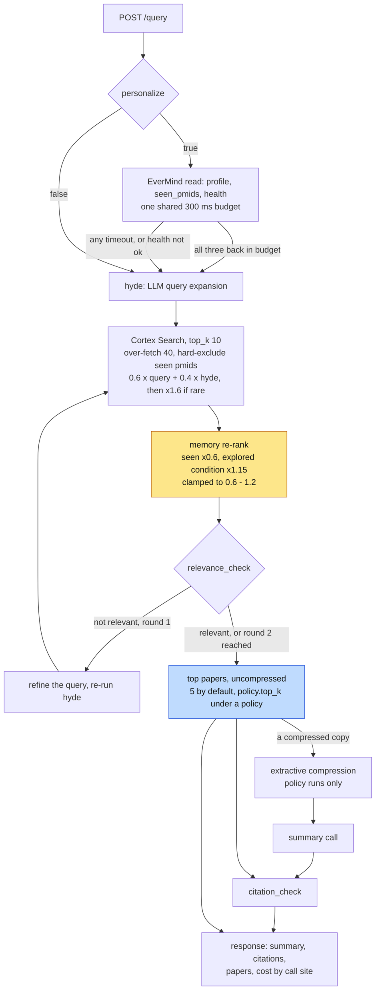
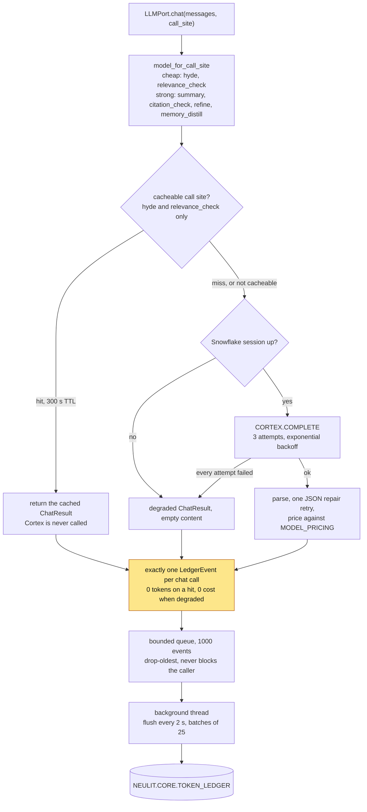

# NeuLitTrace

NeuLitTrace is a memory-aware literature research assistant for neurologists and neuroscience researchers. It searches a focused corpus, checks relevance, writes a cited summary, remembers what a researcher has already explored, and attaches token cost to the answer.

## The problem

Clinical literature work is repetitive and expensive: the same papers resurface, personalization is usually invisible, and multi-step agents rarely show which step consumed the budget. NeuLitTrace makes retrieval, memory effects, and cost attribution inspectable.

## Who it is for

- Clinicians investigating uncommon neurological presentations
- Researchers building a trail across related conditions
- Teams evaluating the cost and reliability of agent pipelines

## What it is not

NeuLitTrace is not a diagnostic device, a substitute for clinical judgment, or a comprehensive medical index. It is a focused research demo whose claims remain linked to source papers.

## How it works

1. A query loads the researcher's EverMind profile when personalization is enabled.
2. Snowflake Cortex Search retrieves papers from the corpus.
3. Memory applies a bounded re-rank so prior work can help without outranking rarity.
4. Cortex COMPLETE runs the applicable calls across six named inference call sites and produces a sourced summary.
5. Each inference call writes a priced row to `TOKEN_LEDGER`.
6. The economy view aggregates spend by step and hour; Cortex Analyst answers questions about those records.
7. The thread and distilled profile are updated for the next query.

The backend exposes retrieval, inference, memory, and ledger through separate ports. A memory or ledger outage therefore degrades one capability instead of collapsing the whole request.

## Snowflake integration

Snowflake provides corpus retrieval through Cortex Search, inference through Cortex COMPLETE, per-call economics in `TOKEN_LEDGER`, aggregate economics views, and a Cortex Analyst surface. The UI shows values returned by the ledger rather than substituting benchmark claims.

The credential-free measurement gate used 28 queries and 280 abstracts: extractive selection reduced estimated context tokens from 64,947 to 42,401 (34.71%), while a representative summary-shaped cost calculation moved from $0.009000 to $0.00775044 (13.88% compression-only). A deliberately synthetic repeat exercise produced 28 cache hits and 28 misses. These verify the local compression, cache, and pricing code paths; they are not live Snowflake consumption or an organic cache-rate claim.

The live account gate verified 329 papers, 14 conditions, 10 rare conditions, an active Cortex Search service over all 329 rows, a successful `claude-sonnet-4-5` COMPLETE call, and ledger read-back for both successful and degraded calls. Three of four Tier-2 live tests passed; the failing test confirms that the current Analyst call shape is not valid and must move to the dedicated Cortex Analyst REST API.

## EverMind integration

EverMind stores a researcher profile and query thread, including specialty, explored conditions, distilled context, and seen papers. Its re-rank multiplier is capped to `[0.6, 1.2]`: personalization can reduce repetition and gently reinforce relevant prior work, but it cannot overpower the retrieval rarity signal. A 300 ms budget keeps memory optional; timeout or failure returns an explicitly unpersonalized answer.

## Stack

- Next.js 16, React 19, TypeScript, Tailwind CSS
- FastAPI with an OpenAPI-generated frontend client contract
- Snowflake Cortex Search, Cortex COMPLETE, Cortex Analyst, and token-ledger views
- EverMind / EverOS memory
- VitePress documentation and D2 diagram sources

## Repository structure

```text
frontend/   Next.js product UI and Playwright tests
backend/    API, pipeline, ports, and adapters
snowflake/  Snowflake setup and data objects
docs/       VitePress documentation and diagrams
```

## Request path

`run_query` is one function with a fixed order. Two steps in it are easy to read backwards: memory adjusts scores but is deliberately the weaker signal, and compression only ever reaches the summary prompt.



The re-rank cap is the personalization argument in two numbers: rarity multiplies a rare paper by 1.6 inside retrieval, and the memory multiplier is clamped to `[0.6, 1.2]`, so the signal that can reorder results the most is the one that has nothing to do with who is asking.

The memory read is all-or-nothing. `get_profile`, `seen_pmids` and `health` share one 300 ms budget; any of the three missing the budget, or a `health` that is not `ok`, returns an explicitly unpersonalized answer. `health` rides along precisely because the other two return empty defaults instead of errors, so a fast success full of defaults would otherwise be indistinguishable from a fast success full of real data.

Compression runs on a copy. `check_citations` and the `papers` in the response both read the original abstracts, so the token saving never reaches the text a claim is verified against.

### Where cost is recorded



Every exit from `chat()` writes exactly one row. The cache hit writes its own before returning early; a `finally` block covers success, all-three-attempts-failed, and an unhandled exception alike. A degraded call is recorded at zero cost rather than dropped, so a missing `TOKEN_LEDGER` row means a lost request, not a free one.

`record()` only enqueues. The INSERT happens on the flush thread, which is why a ledger outage costs rows and never request latency, and why `health()` reports `queued` and `dropped` instead of claiming success.

## Quickstart

Start the credential-free backend profile:

```bash
NEULIT_PROFILE=fake python -m uvicorn backend.api.main:app --reload --port 8000
```

Then run the frontend:

```bash
cd frontend
npm ci
npm run types:gen
npm run dev
```

Open `http://localhost:3000`. The API contract is available at `http://localhost:8000/openapi.json`.

Build the documentation from the repository root:

```bash
npm ci
npm run docs:dev
```

## Limitations

- **Focused corpus:** coverage is limited to 329 papers across 14 conditions. Future work should add governed ingestion and wider neurological coverage.
- **Not real-time:** Cortex Search `TARGET_LAG` means new records are not immediately searchable. Future work should expose index freshness in health metadata.
- **Demo identity model:** memory uses a single namespace and trusts `user_id`; there is no authentication boundary. Production work must add authenticated tenancy and namespace isolation.
- **Memory is bounded and optional:** the re-rank cap deliberately limits personalization. Future evaluation should measure whether different caps improve relevance without creating filter bubbles.
- **Economics depend on the ledger:** when the ledger is unavailable, answers still render but cost is marked unavailable. Future work should add durable retry and reconciliation.
- **Live economics validation is partial:** row counts, Search, COMPLETE, ledger insert/read-back, and a full query were exercised. The measurement gate was not rerun against live traffic, account billing rates remain unreconciled, and real Analyst answers still require the dedicated REST integration.
- **Least privilege is not finished:** the live setup used an `ACCOUNTADMIN`-scoped personal access token for hackathon validation. Deployment must rotate it and run the application under `NEULIT_APP`.
- **Not clinical advice:** summaries can be incomplete or wrong despite citation checks. A clinician must review every source.

## Documentation

Start with the [overview](docs/overview.md), then see [architecture](docs/architecture.md), [token economy](docs/token-economy.md), [memory](docs/memory.md), and the [API reference](docs/api-reference.md).

## License

See [LICENSE](LICENSE).
